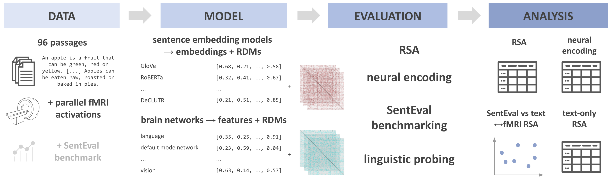

# A Comprehensive Analysis of the Neural Fits of Sentence Embedding Model Paradigms

## 💪 Getting Started

The following figure provides an overview of the workflow of this project.

<p align="center">
  
</p>

### Command Line Interface

Use the following command to get an overview of the main components of the compositionality_study CLI to replicate the analyses:

```shell
$ python3 cli.py --help
```

## 🚀 Installation

The most recent code can be installed directly from GitHub with:

```bash
$ pip install git+https://github.com//compositionality-study.git
```
## 👋 Attribution

### ⚖️ License

The code in this package is licensed under the MIT License.

### 📖 Citation

TODO

### 💰 Funding

This project was supported by funding from the Research Foundation - Flanders (Fonds Wetenschappelijk Onderzoek, FWO) grant 1154623N.

### 🍪 Cookiecutter

This repository is partially based on [@audreyfeldroy](https://github.com/audreyfeldroy)'s
[cookiecutter](https://github.com/cookiecutter/cookiecutter) package using [@cthoyt](https://github.com/cthoyt)'s
[cookiecutter-snekpack](https://github.com/cthoyt/cookiecutter-snekpack) template.
