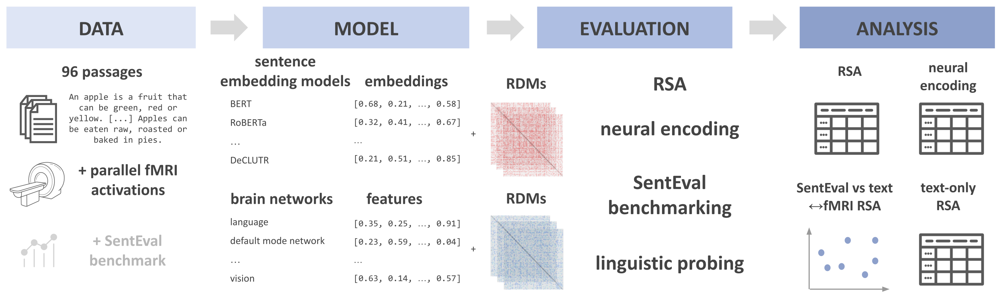

# Investigating Neural Fit Approaches for Sentence Embedding Model Paradigms

This repository contains the code for our paper accepted for ECAI 2023:
> H. Balabin, A. G. Liuzzi, J. Sun, P. Dupont, R. Vandenberghe, and M.-F. Moens, “Investigating Neural Fit Approaches 
> for Sentence Embedding Model Paradigms,” To appear in Proceedings of the 26th European Conference on Artificial 
> Intelligence, Kraków, Poland: IOS Press, Oct. 2023.

## 💪 Getting Started

The following figure provides an overview of the workflow of this project.

<p align="center">
  
</p>

### Data

The basis for this project is the publicly available Pereira dataset (F. Pereira et al., “Toward a universal decoder of 
linguistic meaning from brain activation,” Nat Commun, vol. 9, no. 1, p. 963, Mar. 2018) that can be downloaded 
[here](https://evlab.mit.edu/sites/default/files/documents/index2.html). Once the data for each subject is downloaded,
make sure to place the data for experiment #2 for each subject in the `data/raw/pereira` folder, if you want to repeat
the processing steps from scratch. 

The raw data should be organized as follows:
```
- data
  └── raw
     └── pereira
        ├── M02
        │   └── data_384sentences.mat
        ├── M04
        │   └── data_384sentences.mat
        ...
```

An easier alternative for the subsequential parts of the analyses is to directly use the 
[preprocessed dataset in HuggingFace](https://huggingface.co/datasets/helena-balabin/pereira_fMRI_passages).

### Analyses

The key parts of the analyses can be replicated using the following CLI commands. Note that some steps might require 
previously preprocessed data, and you might need to switch to the right directory first `cd src/sentencefmricomparison`.
- **RSA**
  ```shell
    $ python3 cli.py perform-rsa
  ```
- **Neural encoding**
  ```shell
    $ python3 cli.py calculate-brain-scores-cv-wrapper 
  ```
- **Linguistic probing**
  ```shell
    $ python3 cli.py perform-rsa-text-permutations
  ```
Add the `--help` flag to see the available options for each command.

### Appendices

All file containing all appendices mentioned in the main text of the paper can be found in the `appendices` folder.

## 🚀 Installation

The most recent code can be installed directly from GitHub using:

```bash
$ git clone git@github.com:lcn-kul/sentencefmricomparison.git
$ cd sentencefmricomparison
$ pip install -e .
```
## 👋 Attribution

### ⚖️ License

The code in this package is licensed under the MIT License.

### 📖 Citation

H. Balabin, A. G. Liuzzi, J. Sun, P. Dupont, R. Vandenberghe, and M.-F. Moens, “Investigating Neural Fit Approaches for 
Sentence Embedding Model Paradigms,” To appear in Proceedings of the 26th European Conference on Artificial 
Intelligence, Kraków, Poland: IOS Press, Oct. 2023.

### 💰 Funding

This research was supported by funding from the Research Foundation - Flanders (Fonds Wetenschappelijk Onderzoek, FWO) 
grants 1154623N, 1247821N and from the European Research Council (ERC) under Grant Agreement No. 788506.

### 🍪 Cookiecutter

This repository is partially based on [@audreyfeldroy](https://github.com/audreyfeldroy)'s
[cookiecutter](https://github.com/cookiecutter/cookiecutter) package using [@cthoyt](https://github.com/cthoyt)'s
[cookiecutter-snekpack](https://github.com/cthoyt/cookiecutter-snekpack) template.
